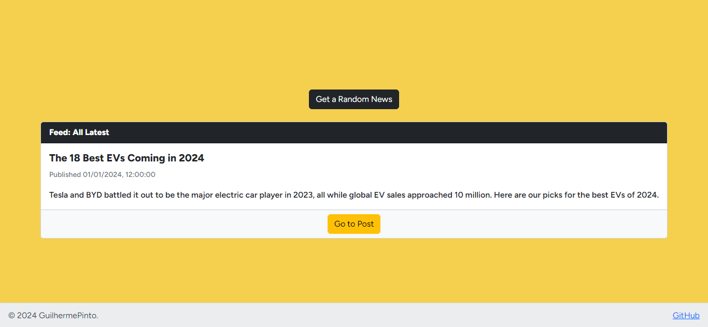

# Frontend Mentor - Blog Preview Card Solution

This is a solution to the [Blog Preview Card challenge on Frontend Mentor](https://www.frontendmentor.io/challenges/blog-preview-card-ckPaj01IcS). 

Frontend Mentor challenges help you improve your coding skills by building realistic projects.

## Table of contents

- [Overview](#overview)
  - [The challenge](#the-challenge)
  - [Screenshot](#screenshot)
  - [Links](#links)
- [My process](#my-process)
  - [Built with](#built-with)
  - [Random Post from RSS](#random-post-from-rss)
  - [Continued development](#continued-development)
  - [Useful resources](#useful-resources)
- [Running](#Running-the-Blog-Preview-Card-Application)
- [Author](#author)
## Overview

### The challenge

Users should be able to:

- See hover and focus states for all interactive elements on the page

### Screenshot



### Links

- [Repository URL](https://github.com/VivaldiCode/Blog-preview-card)
- [Live Site URL](https://blog-preview-card.guilhermepinto.pt)

## My process

### Built with

- Semantic HTML5 markup
- CSS custom properties
- Flexbox
- CSS Grid
- Mobile-first workflow
- [React](https://reactjs.org/) - JS library
- [Styled Components using CoreUI](https://coreui.io/react) - For styles

### Random Post from RSS

One part I'm particularly proud of is the implementation of fetching a random post from various RSS feeds. Here's an explanation of how it works:

```jsx
const fetchRandomPost = async () => {
    try {
        const sources = [
            'https://www.theverge.com/rss/index.xml',
            'https://techcrunch.com/feed/',
            'https://arstechnica.com/feed/',
            'https://www.wired.com/feed/',
            'https://www.techradar.com/rss',
            'https://www.engadget.com/rss.xml',
            'https://gizmodo.com/rss',
            'https://www.zdnet.com/news/rss.xml',
            'https://www.cnet.com/rss/news/'
        ];
        
        // Randomly choose a source
        const source = sources[Math.floor(Math.random() * sources.length)];

        // Construct the URL with CORS proxy
        const url = 'https://corsproxy.io/?' + encodeURIComponent(source);

        // Fetch the RSS feed
        const result = await extract(url);

        // Choose a random post from the fetched entries
        const post = result.entries[Math.floor(Math.random() * result.entries.length)];

        // Set the state with the source and random post
        setSource(result);
        setRandomPost(post);
    } catch (error) {
        console.error('Error fetching random post:', error);
    }
};
```
This function selects a random RSS source from the predefined list, uses a CORS proxy to bypass cross-origin restrictions, fetches the RSS feed, and finally selects a random post from the fetched entries. This adds a dynamic and engaging element to your blog card.

Certainly! Here is the step-by-step guide in Markdown format:


# Running the Blog Preview Card Application

Follow these steps to set up and run the Blog Preview Card application on your local machine.

## Prerequisites

Make sure you have the following software installed on your machine:

- [Node.js](https://nodejs.org/)
- [npm](https://www.npmjs.com/) (Node Package Manager)

## Clone the Repository

Open a terminal and run the following command to clone the repository to your local machine:

```bash
git clone https://github.com/VivaldiCode/Blog-preview-card.git
```

## Navigate to the Project Directory

Change into the project directory using the following command:

```bash
cd Blog-preview-card
```

## Install Dependencies

Run the following command to install the project dependencies:

```bash
npm install
```

## Run the Application

Start the application with the following command:

```bash
npm start
```

This will launch the application, and you can view it in your web browser at [http://localhost:3000](http://localhost:3000).

## Explore the Random Post Feature

The application includes a feature that fetches a random blog post from various RSS feeds. This functionality is automatically triggered when you visit the homepage. The random post is displayed along with information about the source.

Feel free to explore different posts by refreshing the page or navigating to other sections of the application.

### Congratulations!

You have successfully set up and run the Blog Preview Card application on your local machine. If you encounter any issues, please refer to the project's documentation or seek assistance from the [repository owner](https://github.com/VivaldiCode).

## Author

### Website - [Guilherme Pinto](https://guilhermepinto.pt)